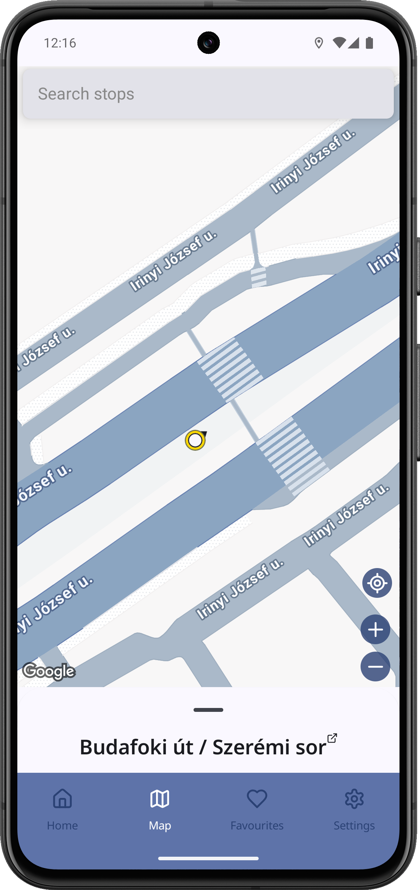
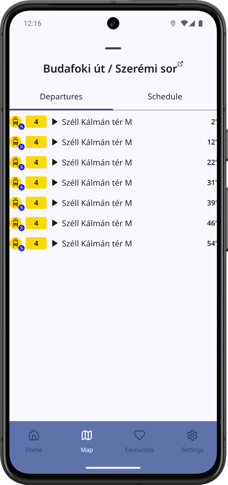
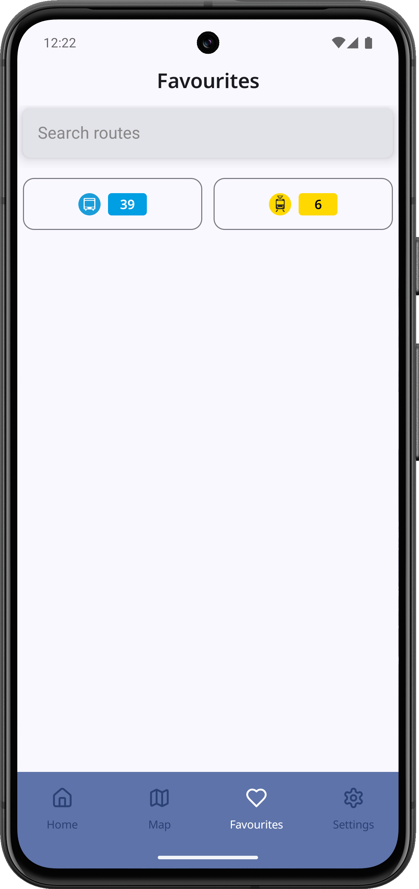
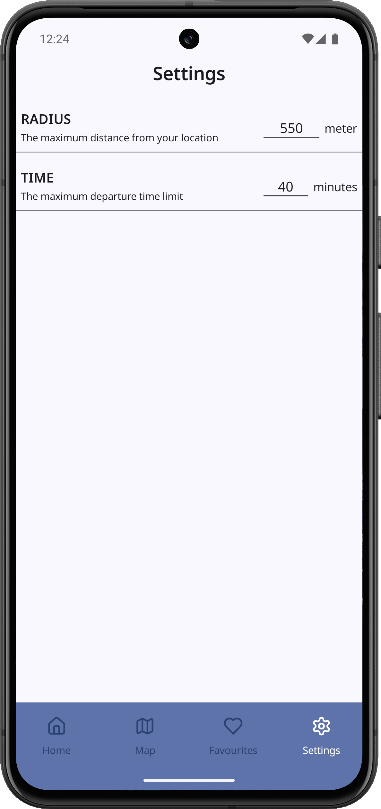

# Next Stop
An Android application providing real-time public transport informations in Budapest, including bus, tram, metro, and other transit services.

## Main Features

- **Nearby Departures**: Displays the nearest public transport stops and the current arrival times of vehicles based on the user's current location.

- **Map View**: Information about stops and routes can also be viewed in a map format.

- **Route and Schedule Information**: By clicking on a selected stop, the departing routes and their departure times, as well as their schedules, are displayed.

- **Trip Planning**: The application recommends various route options to the specified destination.

- **Favorite Routes**: Routes can be saved as favorites for easier access.

- **User Preferences**: Users can configure, for example, the distance within which nearby stops are listed, and the time intervals for which results are provided.

- **Search**: Users can search for routes and stops.

## User Guide

### Home Screen

On the main screen, you can see vehicles arriving at nearby stops. By selecting an option, you can view more details about the stop and its arrival times; if the vehicle is already en route, you can track its current location. In this detailed view, you have the option to mark the given route as a favorite.

Figure 1: Nearby departures on the main screen and the detailed view of the selected vehicle.

### Map Screen

The map view utilizes Google Maps. Custom map functions are implemented in the lower right corner. The crosshair button centers and zooms in on your current location, while the plus and minus buttons control the camera zoom. You can search for any stop via the search bar or by browsing the map, then view detailed stop information in the bottom popup window after selection.

Figure 2: In the map view, stops, the search bar, map control buttons, and the popup window for selected stops are visible.

### Stop Details

By clicking on a desired stop, you can see the list of arriving vehicles and the current day's schedule. Clicking on a row or cell allows you to view the stops and arrival times for that vehicle (see Figure 1.2). On this page, clicking the stop's name initiates route planning from your current location.

Figure 3: Detailed stop information regarding current arrivals and schedule.

### Trip Planner

When planning a route, you can specify a departure or arrival date and time. After starting the planning, you will receive various travel plans, which can be viewed in the popup window. Here, you can see exactly which stop and vehicle to board, and compare the plans by travel time.

Figure 4: The trip planner view and the details of a selected plan.

### Favourites Screen

In the favorites view, you can see the list of routes you have marked as favorite, which you can expand further using the search function. You can search for, view, and mark any route as a favorite.

Figure 5: Marked favorite routes and the search bar in the favorites view.

### Route Details

For a selected route, you can view alternative itineraries by selecting the relevant options. Clicking on stops along the route displays a bottom popup window showing the stop details as previously described (see Figure 3).

Figure 6: The selected route's itineraries and stops.

### Settings Screen

On the settings screen, you can personalize how far away you want to see the list of nearby departures, and within what time range the arrival times should be listed.

Figure 7: User preferences and the edit dialog.

## Used Technologies

- **Dagger Hilt** for Dependency Injection.
- **Ktor** to handle network API calls.
- **Google Maps** for providing the map view.
- **Fused Location** for determining the user's location.
- **Room** for storing favorite routes.
- **Secrets Gradle** for securely storing API keys.
- **DataStore** for storing user preferences.
- **Accompanist Permissions** for managing runtime permissions.
- [PickTime-Compose](https://github.com/anhaki/PickTime-Compose) library for date and time selection.
- [Lucide](https://composeicons.com/icon-libraries/lucide) library for icons used in the application.

## API References
- [BKK FUTÁR API](https://opendata.bkk.hu/data-sources)
- [Google Maps](https://console.cloud.google.com/apis/librarymaps-android-backend.googleapis.com?hl=en-GB)